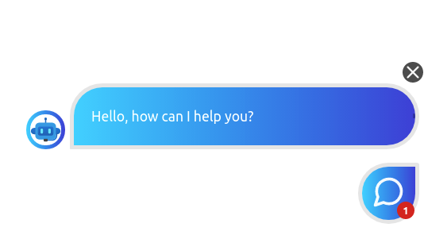
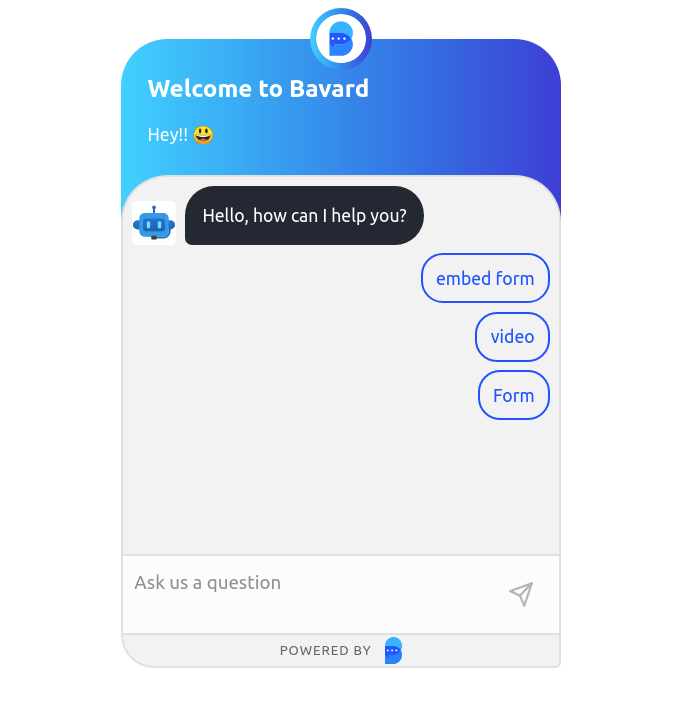

<div align="center">


[)](https://circleci.com/gh/bavard-ai/bavard-react)
[](https://opensource.org/licenses/MIT)

</div>

# Bavard React Components


A small set of React components for easily including Bavard chatbots within any React app.

# Setup 

### 1. Install the npm package.

```
npm i @bavard/bavard-react
```
### 2. Add the Bavard script tag to the `<head>` element of your HTML page.

```html
    <script src="https://bavard-widget-prod.web.app/main.bundle.js"></script>
```

### 3. Import and use the Bavard React components in your app. For example:
```tsx
import React from "react";
import { ChatbotWindowPopup } from "@bavard/bavard-react/ChatbotWindowPopup";
import { ChatbotWindowEmbed } from "@bavard/bavard-react/ChatbotWindowEmbed";

function App() {
  return (
    <div style={{ display: "flex", justifyContent: "center" }}>
      <ChatbotWindowPopup agentId="b4d9de5e-2325-4244-98c4-1526643dd0da" />
      <ChatbotWindowEmbed
        agentId="b4d9de5e-2325-4244-98c4-1526643dd0da"
        widgetId={1}
        style={{ height: 600, width: 400 }}
      />
    </div>
  );
}

export default App;
```

# Popup Chatbot Component
Add a popup chatbot window to your app like this. It is only possible to render a single instance of the popup window at a time.
```tsx
<ChatbotWindowPopup agentId="b4d9de5e-2325-4244-98c4-1526643dd0da" />
```
This results causes a popup-style chatbot to appear in the window's lower right corner.

<div align="center">
  
</div>
<br/>

# Embed Chatbot Component
Add an embeddable chatbot window to your app like this. You can add as many instances as you like, but each one must have a distinct `widgetId` number which should be a positive integer. The embed window is rendered inside a `div` and the dimension are completely up to you, but we recommend at least 375px in width.
```tsx
<ChatbotWindowEmbed
  agentId="b4d9de5e-2325-4244-98c4-1526643dd0da"
  widgetId={1}
  style={{ height: 600, width: 400 }}
/>
```
Here's what an embed chatbot window looks like.

<div align="center">
  
</div>
<br/>

# Versioning

We use [SemVer](http://semver.org/) for versioning. For the versions available, see the [tags on this repository](https://github.com/bavard-ai/bavard-react/tags). 

# License

This project is licensed under the MIT License - see the [LICENSE.md](https://github.com/bavard-ai/bavard-react/blob/main/LICENSE) file for details
